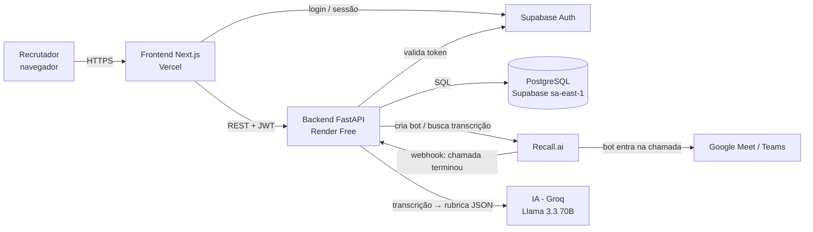

# Rubrica

> **Rubrica ajuda times de recrutamento em empresas de tecnologia a tomar decisões de contratação mais rápidas, justas e bem documentadas — sem depender de anotações manuais feitas às pressas durante a entrevista.**

Um bot entra na entrevista no **Google Meet** ou no **Microsoft Teams**, exibe o aviso de gravação (LGPD) a todos os participantes, transcreve a conversa em português e, ao final, a IA entrega uma **rubrica de avaliação estruturada**: competências com nota, pontos fortes, pontos de atenção, citações do candidato com timestamp e recomendação de próximo passo.

**Equipe:** José Artur Silva Brito (217824) · Luigi (191145)
**Disciplina:** SP2 – Sprint 2: Entrega do MVP

---

## 🔗 Links

| | |
|---|---|
| **Aplicação em produção** | https://SEU-PROJETO.vercel.app ← _preencher após o deploy_ |
| **API (backend)** | https://rubrica-api.onrender.com/health ← _preencher após o deploy_ |
| **Repositório** | https://github.com/ArturJasb/rubrica ← _ajustar_ |

> ⏳ O backend usa o plano gratuito do Render, que "dorme" após 15 min sem uso. O **primeiro acesso pode levar até 1 minuto** — a interface avisa quando isso acontece.

## 👤 Usuário de teste (para avaliação)

| E-mail | Senha |
|---|---|
| `avaliador@rubrica.app` | `Rubrica@2026` |

A conta já tem uma entrevista processada. Para testar o fluxo do zero: **Nova entrevista → Colar transcrição → "Preencher com entrevista de exemplo" → Gerar rubrica** (fica pronta em segundos). Para testar o bot, crie uma reunião no Google Meet, cole o link na aba **Enviar bot para a reunião** e admita o bot "Rubrica | Gravando esta entrevista" quando ele pedir para entrar.

---

## ✅ Funcionalidades desta sprint

| Prioridade (PRD) | Funcionalidade | Status |
|---|---|---|
| Must | Bot entra no Google Meet / Microsoft Teams (via Recall.ai), agora ou no horário marcado | ✅ Implementado (a partir do link da reunião — ver "fora do escopo") |
| Must | Transcrição automática em português, com falante e timestamp | ✅ |
| Must | Rubrica estruturada por IA (competências 1–5, pontos fortes, pontos de atenção, citações, recomendação) | ✅ |
| Must | Painel web para listar, revisar e **buscar por palavra-chave** em todas as transcrições (com candidato + timestamp) | ✅ |
| Must | Aviso de consentimento (LGPD) para todos os participantes: imagem "GRAVANDO" no vídeo do bot + mensagem no chat + confirmação do recrutador | ✅ |
| Must | Gestão de time: workspace compartilhado, convite por e-mail, papéis (admin, recrutador, gestor) | ✅ |
| Extra | Revisão/edição manual da rubrica pelo recrutador | ✅ |
| Extra | Registro de auditoria (quem acessou/editou cada entrevista), visível para o admin | ✅ |
| Extra | Exclusão sob demanda (apaga transcrição, rubrica e mídia no Recall) e **mídia bruta apagada logo após a transcrição** | ✅ |
| Extra | "Colar transcrição": processa entrevistas gravadas fora do bot (e permite testar sem uma reunião ao vivo) | ✅ |
| Should | Exportação de texto pronto para colar no ATS | ✅ Parcial (botão "Copiar para o ATS"; sem PDF) |

### O que ficou de fora e por quê

| Item | Motivo | Plano |
|---|---|---|
| Conexão automática com a **agenda** Google/Microsoft | Exige app OAuth com escopos de calendário, que o Google só libera para uso público após verificação (semanas). No MVP o recrutador cola o link e escolhe o horário, e o bot entra sozinho no horário marcado. | SP3 (Calendar Integration do Recall.ai) |
| Notificação por **e-mail** quando a rubrica fica pronta | Envio transacional gratuito exige domínio próprio verificado. O painel mostra o status em tempo real e se atualiza sozinho. | SP3 |
| Modelos de rubrica customizáveis por vaga (Should) | Priorizamos deixar os Must estáveis. | SP4 |
| Exportação em PDF e integração com a Gupy (Should) | Idem; o "Copiar para o ATS" cobre o uso principal. | Depois do piloto |
| Convite com e-mail automático | Mesmo motivo do e-mail transacional. O admin copia o link ou abre o e-mail já preenchido no próprio cliente de e-mail. | SP3 |
| Backend em região do Brasil | O Render Free não tem região em São Paulo. **Os dados ficam no Brasil** (Supabase `sa-east-1`); só o processamento da API ocorre fora. | Plano pago / AWS `sa-east-1` |

---

## 🏗️ Arquitetura



**Fluxo principal:** cadastro/login → Nova entrevista (link do Meet/Teams) → bot entra e exibe o aviso LGPD → chamada termina → Recall.ai avisa por webhook → API baixa a transcrição, apaga a mídia bruta e gera a rubrica → recrutador revisa, edita e copia para o ATS.

Se o servidor gratuito estiver dormindo e perder o webhook, a página da entrevista consulta o status do bot a cada 10 s (`POST /api/interviews/{id}/sync`), então o fluxo sempre termina.

## 🧰 Stack e hospedagem (tudo no plano gratuito)

| Camada | Tecnologia | Hospedagem |
|---|---|---|
| Frontend | Next.js 15 (React 19, TypeScript) | **Vercel** (Hobby) |
| Backend | Python 3.11, FastAPI, SQLAlchemy | **Render** (Free) |
| Banco de dados | PostgreSQL | **Supabase** (Free, região São Paulo) |
| Autenticação | Supabase Auth (e-mail e senha) | Supabase |
| Bot de reunião + transcrição | Recall.ai (`recallai_streaming`, pt) | Recall.ai (5 h grátis) |
| Geração da rubrica | Llama 3.3 70B via API compatível com OpenAI | **Groq** (Free) — trocável por Gemini/OpenAI por variável de ambiente |

## 📁 Estrutura

```
rubrica/
├── backend/                 # API FastAPI
│   ├── app/
│   │   ├── main.py          # app, CORS, rotas
│   │   ├── auth.py          # valida o token do Supabase, workspace e papéis
│   │   ├── models.py        # tabelas (workspaces, members, invites, interviews, transcript_segments, audit_logs)
│   │   ├── routers/         # interviews, team, webhooks
│   │   └── services/        # recall.py (bot), llm.py (rubrica), pipeline.py, transcript.py
│   ├── scripts/             # usuário de teste, transcrição de exemplo, imagem do aviso LGPD
│   ├── tests/               # testes automatizados (pytest)
│   └── requirements.txt
├── frontend/                # Next.js
│   ├── app/                 # páginas: /, /entrar, /cadastro, /painel, /entrevistas/nova, /entrevistas/[id], /time
│   ├── components/
│   └── lib/                 # cliente da API, Supabase, tipos
├── docs/DEPLOY.md           # passo a passo de publicação
└── render.yaml              # blueprint do Render
```

## 💻 Rodando localmente

**Pré-requisitos:** Python 3.11+, Node.js 20+, um projeto gratuito no Supabase e uma chave da Groq. A chave do Recall.ai só é necessária para testar o bot.

### 1. Backend

```bash
cd backend
python -m venv .venv
source .venv/bin/activate          # Windows: .venv\Scripts\activate
pip install -r requirements-dev.txt
cp .env.example .env               # preencha as variáveis
uvicorn app.main:app --reload      # http://localhost:8000/docs
```

Sem `DATABASE_URL`, o backend usa um SQLite local (`rubrica.db`), bom para desenvolvimento. As tabelas são criadas automaticamente na inicialização.

### 2. Frontend

```bash
cd frontend
npm install
cp .env.example .env.local         # preencha as variáveis
npm run dev                        # http://localhost:3000
```

### 3. Testes

```bash
cd backend && pytest -q            # Supabase, Recall.ai e IA simulados
cd frontend && npm run build       # checagem de tipos e lint
```

### Variáveis de ambiente

Todas estão documentadas em [`backend/.env.example`](backend/.env.example) e [`frontend/.env.example`](frontend/.env.example). **Nenhum segredo fica no repositório.** Os arquivos `.env` estão no `.gitignore`.

## 🔒 LGPD e segurança

- Aviso de gravação exibido a **todos os participantes** quando o bot entra (vídeo + chat), e confirmação obrigatória do recrutador antes de criar a entrevista.
- **Minimização:** áudio e vídeo brutos são apagados no Recall.ai assim que a transcrição é salva (`RECALL_DELETE_MEDIA=true`).
- **Exclusão sob demanda:** o botão "Excluir" apaga transcrição, rubrica e mídia.
- **Controle de acesso por papel** (admin, recrutador, gestor) e **registro de auditoria** de acessos e edições.
- TLS em todo o tráfego (Vercel, Render e Supabase); dados em repouso criptografados pelo Supabase (AES-256), na região de São Paulo.
- A IA é instruída a não considerar características pessoais protegidas, e a interface lembra que a decisão final é humana.

## 🗺️ API (resumo)

| Método | Rota | Descrição |
|---|---|---|
| GET | `/api/me` | Usuário, papel e workspace (cria o workspace no primeiro login ou aceita convite) |
| GET | `/api/interviews` | Lista as entrevistas do workspace |
| POST | `/api/interviews` | Cria entrevista e envia o bot à reunião |
| POST | `/api/interviews/manual` | Cria entrevista a partir de transcrição colada |
| GET | `/api/interviews/{id}` | Detalhe: rubrica, transcrição e auditoria |
| POST | `/api/interviews/{id}/sync` | Consulta o status do bot no Recall.ai |
| PUT | `/api/interviews/{id}/rubric` | Salva a rubrica editada |
| POST | `/api/interviews/{id}/regenerate` | Gera a rubrica novamente |
| DELETE | `/api/interviews/{id}` | Exclui (LGPD) |
| GET | `/api/search?q=` | Busca nas transcrições (candidato + timestamp) |
| GET/POST/PATCH/DELETE | `/api/team…` | Membros, convites e papéis |
| POST | `/api/webhooks/recall?token=` | Webhook do Recall.ai |

Documentação interativa: `/docs` no backend.
